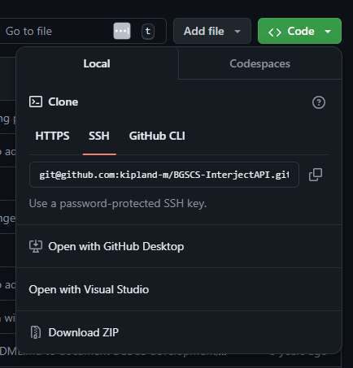

# Getting Started with Git
Before you start, ensure you have Git installed on your system. You can download it from https://git-scm.com/downloads.

To verify the installation, open your terminal or command prompt (use Git Bash if on Windows) and type:

`git --version`

If this returns a string of text similar to `git version 2.30.2.windows.1` Git is working as intended.

## Authenticating with GitHub
Before you clone a repository and start working in Git, you should get your authentication out of the way.
GitHub really emphasizes nowadays that you are using SSH as your authentication method, so the rest of this brief guide will
assume that you are following suit.

Here are two articles from GitHub's docs that will guide you through authenticating with SSH.

### [Generating a new SSH key and adding it to the agent](https://docs.github.com/en/authentication/connecting-to-github-with-ssh/generating-a-new-ssh-key-and-adding-it-to-the-ssh-agent)

This is handling your personal SSH key and instance on your terminal. What you will do in this guide pertains completely to your local machine.

### [Adding a new SSH key to your GitHub account](https://docs.github.com/en/authentication/connecting-to-github-with-ssh/generating-a-new-ssh-key-and-adding-it-to-the-ssh-agent)

This is adding your newly generated local key to your GitHub account! After this process you are ready to clone the Interject repository from GitHub.

## Cloning
Next, you should navigate to the remote repository that contains the Interject project.

Use `git clone git@github.com:kipland-m/BGSCS-InterjectAPI.git` to download the repository.
It is important that you use the SSH link. If it gives an error, there may be an issue with the authentication covered in the previous paragraph.

This will download the repository into a folder with the name of the repo, and will automatically handle initializing git.
Once you successfully clone the repo, you are ready to develop and make changes/additions with your common `git add` `git commit` `git push` workflow.

