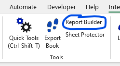
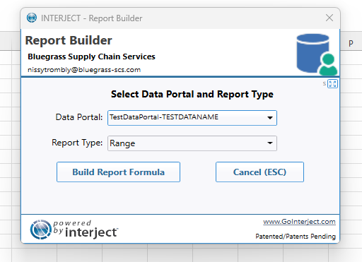
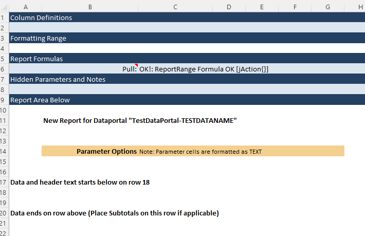

An overview on how to configure an Excel sheet to be an Interject Report

## Getting authenticated

Assuming you have already installed the Interject add-in for Excel (see Environment Setup)

You will need to login to your Interject account.

## Using the Report Builder

Once you are authenticated, you will be able to use the Report Builder.

Click on the report builder, and you will be prompted to choose a data portal.

For a basic report, leaving the 'Report Type' to 'Range' is fine.

## Getting Data into Your New Report

A freshly generated report should look like this:

At this point, if everything was configured correctly (Data Portal, Controller file, Interject API server is running)
then should be able to Ctrl + Shift + J and 'Pull Data' and get some data into your report!
