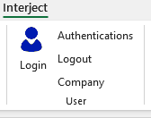

An overview on how to configure an Excel sheet to be an Interject Report

## Getting authenticated

Assuming you have already installed the Interject add-in for Excel (see Environment Setup)

You will need to login to your Interject account.

## Using the Report Builder

Once you are authenticated, you will be able to use the Report Builder

