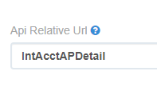

# Interject API 

A basic overview of using the Interject API 

## Getting started

Get started by downloading the SDK

**[Interject Server Repository](https://github.com/kipland-m/Interject_API)**

This contains the server, existing report controllers, etc

## Creating a new Interject Data Portal

Before you get into the code, it is preferable to have a data portal created. Why this is, will be more apparent once we are in the coding part.

Once you have the Interject server repository cloned from GitHub the initial step for creating a new Interject report is to create a new Data Portal.

**[Interject Data Portal Panel](https://portal.gointerject.com/DataPortals.html)**

**Data Portal Code**

When creating a data portal, use the convention of "NameOfReport-INTACCTOBJECTNAME"

For example, if you are calling the report the Budget Details report and the data is coming from GLBUDGETITEM in Intacct, the data portal would be named BudgetDetails-GLBUDGETITEM

**Category**

Add the data portal to the 'kip-python' category to help visually separate internally developed reports from existing reports.

**Connection**

Add the data portal to the 'localPythonExmple' connection for use on your local machine. Once development and testing is done and the code is pushed to the server, this will be changed to the 'pythonInternal' connection.

At this point the Data Portal side of the report is good for now, as mentioned above, after the development and testing is done for the report you will come back to this.

## Creating the backend for a new report

Create a Controller .py file based on what data you are connecting to a report.

So, if creating a report using Intacct data you would create a controller.py file in 
**InterjectApi\Controllers\IntAcct_PANDAS_Controllers**

And if creating a report using Mcleod data it would be in  
**InterjectApi\Controllers\Mcleod_Controllers**  
*Both will utilize PANDAS, but with Mcleod controllers it is implied since Intacct used to not use PANDAS.*

Find a report that is similar to your end goal to use as boilerplate. So if your report is going to have filters, or if it is only pulling from a certain layer in Intacct for example, it would be smart to use the code from a report that already has those features built in to make things easier.

Once you create your new controller file and borrow code from a past report, go ahead and name it following the convention of the other controller files.

Then, near the top of the file, you will see the class definition  
`class IntAcctInvByJobController(BaseRequestController):`


This class definition is from the 'Intacct_InvByJob_Controller.py' report.

Make sure to change your class definition to fit the name of your newly created .py file. This is important for the next step.

**Progress Check**


At this point you should have

 - A Data Portal Created (With appropriate name, added to kip-python category, added to localPythonExmple connection)

 - A new controller file (.py) (With code copied from a similar report, with appropriate file and class naming)


## Creating imports in server.py

Once you have your Data Portal created and your controller file created, you need to add import statements.

In **InterjectApi\server.py** there will be a large block of import statements.

```
from Controllers.IntAcct_PANDAS_Controllers.IntAcct_Revenue_Controller import IntAcctRevenueController
from Controllers.IntAcct_PANDAS_Controllers.IntAcct_RefNo_Controller import IntAcctRefNoController
from Controllers.IntAcct_PANDAS_Controllers.IntAcct_TransactionDetail_Controller import IntAcctTransactionDetailController
from Controllers.IntAcct_PANDAS_Controllers.IntAcct_TransactionHeader_Controller import IntAcctTransactionHeaderController
from Controllers.IntAcct_PANDAS_Controllers.IntAcct_Employee_Controller import IntAcctEmployeeController
from Controllers.IntAcct_PANDAS_Controllers.IntAcct_PANDAS_VendorType import IntAcctVendorPANDAS
from Controllers.IntAcct_PANDAS_Controllers.IntAcct_Classes_Controller import IntAcctClassController
from Controllers.IntAcct_PANDAS_Controllers.Intacct_InvByJob_Controller import IntAcctInvByJobController
from Controllers.IntAcct_PANDAS_Controllers.IntAcct_APHeader_Controller import IntAcctAPController
from Controllers.IntAcct_PANDAS_Controllers.IntAcct_APDetail_Controller import IntAcctAP2Controller
from Controllers.IntAcct_PANDAS_Controllers.IntAcct_Job_Controller import IntAcctJobController
from Controllers.IntAcct_PANDAS_Controllers.IntAcct_PurchasingTransactionsDetail_Controller import IntAcctPurchasingLines
from Controllers.IntAcct_PANDAS_Controllers.IntAcct_PurchasingTransactions_Controller import IntAcctPurchasing
from Controllers.IntAcct_PANDAS_Controllers.IntAcct_BudgetDetails_Controller import IntAcctBudgetDetail
```
And below this, there will be more for McLeod reports.

Add your import for your new controller here.

Further down this file, you will see another block that is adding these classes we are importing above as accessible API resources.

```
API.add_resource(IntAcctAPController, '/api/IntAcctAPHeader')
API.add_resource(IntAcctAP2Controller, '/api/IntAcctAPDetail')
API.add_resource(IntAcctRevenueController, '/api/IntAcctRevenue')
API.add_resource(IntAcctRefNoController, '/api/IntAcctRefNo')
API.add_resource(IntAcctTransactionDetailController, '/api/IntAcctTransactionDetail')
API.add_resource(IntAcctTransactionHeaderController, '/api/IntAcctTransactionHeader')
API.add_resource(IntAcctVendorController, '/api/IntAcctVendor')
API.add_resource(IntAcctVendorTypeController, '/api/IntAcctVendorType')
API.add_resource(InterjectDefaultRequestController, '/api/InterjectDefaultRequest')
API.add_resource(IntAcctEmployeeController, '/api/IntAcctEmployee')
API.add_resource(IntAcctJobController, '/api/IntAcctJobs')
API.add_resource(IntAcctPurchasing, '/api/IntAcctPurchasing')
API.add_resource(IntAcctPurchasingLines, '/api/IntAcctPurchasingLines')
API.add_resource(IntAcctBudgetDetail, '/api/IntAcctBudgetDetail')
```
You will use this same format to add your imported class as a resource with 'API.add_resource', followed by the class name, and the endpoint.

## Adding API resource to Data Portal

Okay, we are going to go back to the Interject DataPortals panel to do one last thing to our DataPortal.
The endpoint you just created needs to be entered into the API relative URL.



In this box, enter your API URL in place of the 'IntAcctAPDetail'

`API.add_resource(MyReport, '/api/MyReportEndpoint')` with this as an example, you would place `MyReportEndpoint` in this box.

**Progress Check & Section End**

At this point you should have

 - A Data Portal Created (With appropriate name, added to kip-python category, added to localPythonExmple connection)

 - A new controller file (.py) (With code copied from a similar report, with appropriate file and class naming)

 - Importing of controller classes and API resource endpoints created in server.py

 - API relative URL that corresponds to your resource endpoint in your Data Portal

Next we will look into creating the Excel spreadsheet to display your data pulls in the 'frontend' using the Interject Excel add-in.
