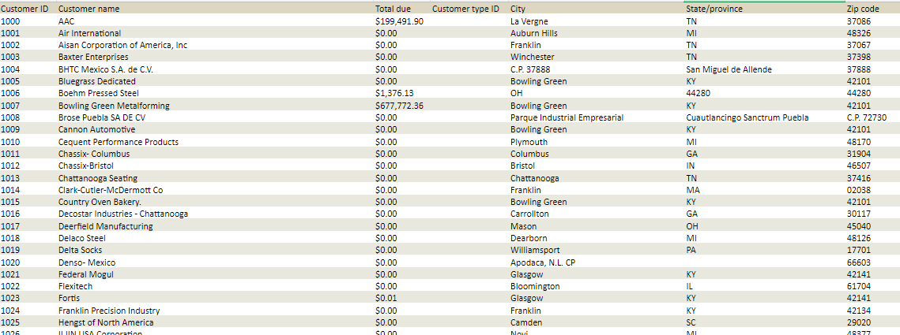

This is an example of how to create and deploy an Interject report as per request.

## Workflow Example

I have received a request to build an Interject report utilizing data from Intacct.
I figured it would be valuable to document my thought process and workflow of how I would build out this report.

Usually when an Interject report is requested a sample report may be provided. This would usually be sourced from some manual export but the advantage with building an Interject report is that you are able pull a fresh updated set of data at will.

So, say our instructions start as so:

"Hi Interject Developer, would you be able to build out a report similar to such?"

So with this given, we know we need to create a report that simply pulls all of our customer data in one pull. Since there are no requests for filtering on this data, we will assume we do not need to write any filters into our code.

The first thing I would recommend doing and I have covered this in the 'Interject API Basic Usage' section- creating a Data Portal in the Interject Admin site.

## Creating a Data Portal for this report

**Data Portal Code** | `CustomerReport-CUSTOMER`

**Category** | `kip-python`

**Connection** | `localPythonExmple`

**Api Relative Url** | `IntAcctCustomer`

The naming convention is detailed more in the 'Interject API Basic Usage' but I wanted to reiterate and give a real world example of how I would create a data portal here.

We will now create this data portal!

## Getting into the code

Now, navigate over to your editor. Go to `InterjectApi/Controllers/IntAcct_PANDAS_Controllers`

I'm going to create a file here called `IntAcct_Customer_Controller.py`

Now, since I know that this report has no filters, it is simply just a data dump, I will copy the code from a controller in this same directory (IntAcct_PANDAS_Controllers) that is similar (i.e. does not have filters, is just a simple data dump.)